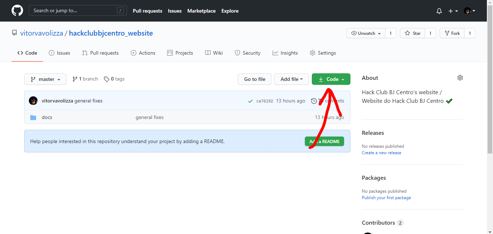

Guia prático para traduzir workshops do Hack Club

 

Olá, ficamos muito felizes que você resolveu nos ajudar! Para traduzir os workshops é necessário conhecimento básico de [git](https://www.youtube.com/watch?v=IBClN6VpJDw&list=PLlAbYrWSYTiPA2iEiQ2PF_A9j__C4hi0A){:target="_blank"} e de [markdown](https://github.com/luong-komorebi/Markdown-Tutorial/blob/master/README_pt-BR.md){:target="_blank"}. Fica tranquilo que você pode contar com a gente. Se precisar é só perguntar [aqui](https://github.com/vitorvavolizza/hackclubbjcentro_website/issues/new){:target="_blank"}.

## Instalação do Projeto

Vá para [https://github.com/vitorvavolizza/hackclubbjcentro_website](https://github.com/vitorvavolizza/hackclubbjcentro_website){:target="_blank"}.

E clique no botão verde `Code`.

Depois, copie o URL.

Vá para seu terminal, crie um diretório novo com `mkdir "nome-do-diretorio"` . Vá para seu diretório novo com `cd "nome-do-diretorio"`. E por fim clone o repositório do site do Hack Club BJ Centro com `git clone "url-copiado"`

Ele vai demorar um tempo clonando o repositório, depois que o processo estiver acabado, vá para o diretório com `cd hackclubbjcentro_website`. E execute `gem install jekyll -v 3.9.0` para instalar o jekyll e `gem install bundler` para instalar o bundler.

Com o bundler e o jekyll instalados, entre na pasta docs com `cd docs` e execute `bundle install` para instalar todas as dependências.

E a partir de agora você está pronto para começar.

Para executar seu projeto digite `bundle exec jekyll serve` na linha de comando.

Você verá algo muito parecido com isto.

A URL ao lado do `Server address` indica a URL com o seu projeto. Abra no navegador essa URL e você verá o site do Hack Club BJ Centro.

Sensacional! Você está pronto para começar a traduzir workshops.

## Flow de Tradução

Bem, o flow de tradução é bem simples. Abra seu projeto em um editor de código e dê uma olhada nos diretórios.

Você verá uma pasta workshops, é lá que todos os workshops estão armazenados.

Crie uma nova pasta com o nome traduzido do workshop que você deseja traduzir dentro da pasta `workshops`. Depois disso, crie uma pasta `img` dentro da pasta com o novo nome. Feito isso, copie um arquivo README.md de outro workshop e cole dentro da sua pasta com o nome traduzido.

## Header

A primeira coisa que você vai ver no arquivo README.md é o header. Ele contém informações interessantes para o site, que vão ser utilizadas para renderizar o workshop da melhor maneira possível.

`title` -> é o título do workshop em português

`description` -> é a descrição do workshop em português

`bg-image` -> é o caminho para a imagem de fundo utilizada na página workshops Ex: /workshops/nome-do-workshop/fundo.png

`permalink` -> é a url que vai ser utilizada para acessar o workshop Ex: /workshops/nome-do-workshop/

`order` -> é a ordem que o workshop aparece na página workshops

Nesse momento é muito interessante que você esteja com o workshop original do seu lado para ir realizando as traduções! Para isso você terá que clonar ou baixar o repositório original do Hack Club aqui: [https://github.com/hackclub/hackclub](https://github.com/hackclub/hackclub).

## Autoria

Depois do header você verá a seção de autoria. É onde você colocará o GitHub do autor original do workshop e o GitHub do tradutor. No caso, o seu. :)

Substitua os valores dos `hrefs` e os valores entre as tags `<a>` com as devidas informações.

## Tradução

Legal, agora é a parte essencial. A tradução do workshop. Você poderá utilizar as ferramentas que preferir para fazer esse processo, contanto que o workshop seja 100% entendível para alguém que só fale português.

Eu prefiro traduzir o workshop e ir testando ele no processo. Mas você pode fazer da maneira que preferir.

Aqui vão algumas regras para a tradução:

- As imagens que contenham elementos em inglês devem ser substituídas por imagens tiradas por você com a versão traduzida em português do workshop.
- A versão traduzida do workshop deve estar 100% funcional.
- Traduza tudo que for possível, incluindo nomes de variáveis, funções e arquivos. Com exceção de termos especifícos como "Hooks" no React.
- Se depois de acabar a tradução perceber que o workshop original continha alguns erros, abra um pull request para a seção de workshops do Hack Club Internacional.

Depois que seu workshop estiver pronto para um líder de clube brasileiro usar no clube dele, abra um pull request e ele será analisado para depois ser colocado no site brasileiro do Hack Club.

Beeeem, eu acho que é isso. Em caso de dúvidas, mande uma mensagem para nosso time no Slack do Hack Club. Somos o grupo [@brasil](https://app.slack.com/client/T0266FRGM/browse-user-groups/user_groups/S01L1TL2RUY).

 :)
