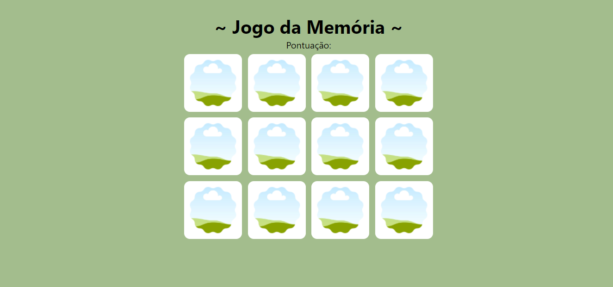
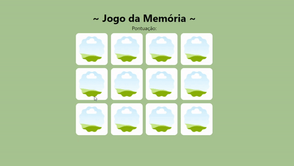
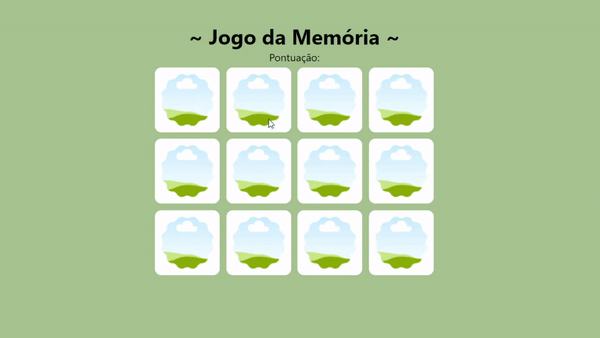
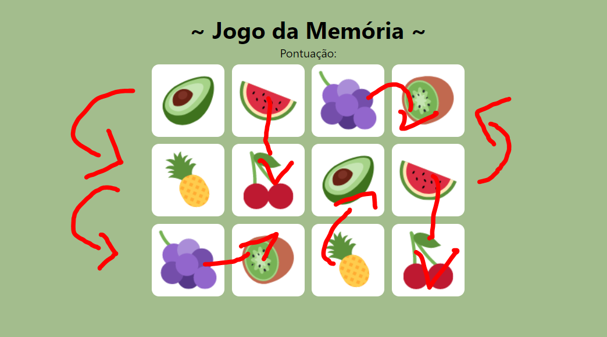

<center>Crie seu próprio jogo da memória utilizando JavaScript</center>  
<center>Feito por <a href="https://github.com/giridhar7632" target="_blank">@giridhar7632</a></center>
<center>Traduzido por <a href="https://github.com/vitorvavolizza" target="_blank">@vitorvavolizza</a></center>

<br />

# Jogo da memória

O jogo da memória é um jogo de cartas simples em que você precisa combinar pares virando 2 cartas por vez. Neste workshop, vamos construir um jogo de memória simples utilizando JavaScript. Dê uma olhada no projeto final e no código.


[Demonstração ao vivo](https://jogo-da-memoria-final.hcbjcentro.repl.co/) e [Código-fonte](https://repl.it/@hcbjcentro/jogo-da-memoria-final#script.js).

## Como jogar...

### Regras

- Você vai começar virando uma carta.
- Se a próxima carta que você virar for igual a primeira, você ganha +1 em sua pontuação.
- Essas cartas então desaparecem.
- Se a próxima carta que você virar não combinar com a outra, as cartas viram de volta.
- O jogo continua até que você combine todas as cartas do tabuleiro.

## Pré-requisitos


Conhecimento básico de HTML5, CSS3 e JavaScript. Usaremos algumas funções embutidas do JavaScript. Além disso, o estilo será o mais simples possível.

## Configuração

O [Repl.it](https://repl.it) é um editor de código online, usaremos ele para escrever nosso código.

Entre no projeto inicial [aqui](https://repl.it/@hcbjcentro/memoria-inicial#index.html) e clique em Fork. Seu ambiente de desenvolvimento estará pronto em alguns segundos!


Ele contém um arquivo `index.html` vazio vinculado aos arquivos `style.css` e `script.js`.

Vamos criar um jogo simples de cartão de memória 3 x 4 neste workshop. Usaremos imagens para os cartões. Fornecerei os links públicos para as imagens junto com o código. Se preferir fazer o download, você pode baixá-las [aqui](https://drive.google.com/drive/folders/128S-rB27-86ciSyJvjkfK2NhJeoOmsB3?usp=sharing). Você também pode adicionar suas próprias imagens. Certifique-se de que elas têm 100 x 100 px para evitar aplicar mais estilos.

Depois de configurar, vamos prosseguir.

## O HTML

Vamos criar o esboço do nosso jogo.

Altere o `title` para alguma coisa divertida e crie um `h1` dentro do `body`. Depois, crie um parágrafo com um `span` de id `pontuacao`.

```html
<h1>~ Jogo da Memória ~</h1>
<p>Pontuação: <span id="pontuacao"></span></p>
```

Crie um elemento `div` com uma classe de `tabuleiro`. Vamos criar o tabuleiro do jogo usando JavaScript dentro deste `div`.

```html
<div class="tabuleiro"></div>
```

O seu arquivo `index.html` vai parecer com isso no final:

```html
<!DOCTYPE html>
<html>
  <head>
    <meta charset="utf-8">
    <meta name="viewport" content="width=device-width">
    <title>Jogo da Memória</title>
    <link href="style.css" rel="stylesheet" type="text/css" />
  </head>
  <body>
    <h1>~ Jogo da Memória ~</h1>
    <p>Pontuação: <span id="pontuacao"></span></p>
    <div class="tabuleiro"></div>
    <script src="script.js"></script>
  </body>
</html>
```

Clique no botão Run para verificar se todas as tags estão funcionando.


Todos os estilos já estão escritos no projeto inicial no arquivo `style.css`.

Concluímos o esboço do nosso projeto. Agora vá para o arquivo `script.js` e vamos começar a criar o jogo.

## O JavaScript

Crie um DOM [event-listener](https://developer.mozilla.org/en-US/docs/Web/API/EventListener) para o evento [DOMContentLoaded](https://developer.mozilla.org/en-US/docs/Web/API/Document/DOMContentLoaded_event). Todo o nosso código JavaScript estará dentro do listener de eventos, que será executado depois que o conteúdo da página da web for carregado.

```javascript
document.addEventListener('DOMContentLoaded', () => {
  // O código vai aqui...
})
```

Dentro do listener de eventos, crie um array para as cartas que usaremos no jogo. Adicione duas de cada carta para o jogador poder combiná-las. Os links públicos para as imagens são fornecidos no código abaixo. Se você baixou as imagens ou usou suas próprias imagens, adicione o caminho relativo às imagens. Além disso, nomeie-as como desejar.

```javascript
document.addEventListener('DOMContentLoaded', () => {
  const arrayDeCartas = [
    {
      name: '1',
      img: 'https://cloud-5ystxzer7.vercel.app/11.png'
    },
    {
      name: '2',
      img: 'https://cloud-5ystxzer7.vercel.app/22.png'
    },
    {
      name: '3',
      img: 'https://cloud-5ystxzer7.vercel.app/33.png'
    },
    {
      name: '4',
      img: 'https://cloud-5ystxzer7.vercel.app/44.png'
    },
    {
      name: '5',
      img: 'https://cloud-5ystxzer7.vercel.app/55.png'
    },
    {
      name: '6',
      img: 'https://cloud-5ystxzer7.vercel.app/06.png'
    },
    {
      name: '1',
      img: 'https://cloud-5ystxzer7.vercel.app/11.png'
    },
    {
      name: '2',
      img: 'https://cloud-5ystxzer7.vercel.app/22.png'
    },
    {
      name: '3',
      img: 'https://cloud-5ystxzer7.vercel.app/33.png'
    },
    {
      name: '4',
      img: 'https://cloud-5ystxzer7.vercel.app/44.png'
    },
    {
      name: '5',
      img: 'https://cloud-5ystxzer7.vercel.app/55.png'
    },
    {
      name: '6',
      img: 'https://cloud-5ystxzer7.vercel.app/06.png'
    }
  ]

  // O código vai aqui...
})
```

Agora estamos prontos para criar nosso tabuleiro do jogo.

## Tabuleiro

Lembre-se, vamos codificar tudo após o `arrayDeCartas`.

Agora temos que criar quatro constantes:

- `tabuleiro`: O elemento `div` com a classe `tabuleiro` usando o [querySelector](https://developer.mozilla.org/en-US/docs/Web/API/Document/querySelector).
- `resultado`: O `span` com um id de `pontuacao`, para adicionarmos a pontuação ao vivo.
- `placeholder`: O placeholder da imagem. O placeholder representa a parte de trás das cartas.
- `branco`: para a imagem em branco. No lugar de uma imagem vazia, uma imagem branca é mostrada.

```javascript
const tabuleiro = document.querySelector('.tabuleiro')
const resultado = document.querySelector('#pontuacao')
const placeholder = 'https://cloud-5ystxzer7.vercel.app/7placeholder.png'
const branco = 'https://cloud-5ystxzer7.vercel.app/6blank.png'
```

Agora crie uma função `criarTabuleiro()` e itere sobre os elementos do `arrayDeCartas` usando um loop `for` e adicione as cartas ao nosso tabuleiro.

```js
function criarTabuleiro() {
  for (let i = 0; i < arrayDeCartas.length; i++) {
    // o Código vai aqui...
  }
}
```

Crie um elemento `img` usando `document.createElement` para cada carta.

```js
var carta = document.createElement('img')
```

Usando `setAttribute()`, adicione os atributos `src` e `data-id` à imagem. Vamos primeiro definir o atributo `src` para a imagem do placeholder (ou seja, vamos assumir a imagem do placeholder como uma carta invertida). O link para a imagem do placeholder é fornecido no código, caso contrário, adicione o caminho relativo à imagem.

```js
carta.setAttribute('src', placeholder)
carta.setAttribute('data-id', i)
```

**Explicação:**

- [createElement()](https://developer.mozilla.org/en-US/docs/Web/API/Document/createElement) cria o elemento HTML especificado pela tagName.
- [setAttribute()](https://developer.mozilla.org/en-US/docs/Web/API/Element/setAttribute) define o valor de um atributo no elemento especificado.
- [data-attribute](https://developer.mozilla.org/en-US/docs/Learn/HTML/Howto/Use_data_attributes) nos permite armazenar informações extras sobre o padrão da tag HTML.

De acordo com o jogo, temos que virar a carta clicada. Adicione um listener de eventos `click` para a carta. Cada vez que uma carta for clicada, a função `viraCarta` será executada, que definiremos mais tarde no código. Por enquanto, comente o listener de eventos, já que `viraCarta` ainda não foi definida.

```js
carta.addEventListener('click', viraCarta)
```

Depois, adicione a `carta` no `tabuleiro` usando `appendChild()`.

```js
tabuleiro.appendChild(carta)
```

O método [appendChild()](https://developer.mozilla.org/en-US/docs/Web/API/Node/appendChild) adiciona um nó ao final da lista de filhos de um pai especificado.

A função que criamos, ficará assim:

```javascript
const tabuleiro = document.querySelector('.tabuleiro')
const resultado = document.querySelector('#pontuacao')
const placeholder = 'https://cloud-5ystxzer7.vercel.app/7placeholder.png'
const branco = 'https://cloud-5ystxzer7.vercel.app/6blank.png'

// Cria tabuleiro do jogo - A 4° linha da função foi
// comentada porque ainda não criamos a função viraCarta
function criarTabuleiro() {
  for (let i = 0; i < arrayDeCartas.length; i++) {
    var carta = document.createElement('img')
    carta.setAttribute('src', placeholder)
    carta.setAttribute('data-id', i)
    //carta.addEventListener('click', viraCarta)
    tabuleiro.appendChild(carta)
  }
}
```

Depois de definir a função, chame ela com:

```js
criarTabuleiro()
```

Pressione o botão Run e veja o seu tabuleiro do jogo.

Os cartões estão virados para baixo (ou seja, estão mostrando a imagem de placeholder).



## viraCarta

Quando uma carta é clicada, vamos virá-la.

Crie dois arrays de variáveis ​​vazios `cartasClicadas` e `cartasClicadasId`. Além disso, crie um array de variável `cartasCombinadas` para enviar as cartas correspondentes.

```js
var cartasClicadas = []
var cartasClicadasId = []
var cartasCombinadas = []
```

Crie a funcão `viraCarta()`. Depois, dentro dela, crie a variável `cartaId`, que é o atributo `data-id` de uma carta clicada, usando `getAttribute()`.

```js
function viraCarta() {
  var cartaId = this.getAttribute('data-id')
  // O Código vai aqui...
}
```

Agora adicione o nome deste cartão no array `cartasClicadas` baseado no `cartaId` usando o método `push()`. Coloque também o id deste cartão (ou seja, `cartaId`) na matriz `cartasClicadasId`.

```js
cartasClicadas.push(arrayDeCartas[cartaId].name)
cartasClicadasId.push(cartaId)
```

Em seguida, adicione a parte frontal do cartão. A imagem no `arrayDeCartas` correspondente ao `cartaId`, usando `setAttribute`.

```js
this.setAttribute('src', arrayDeCartas[cartaId].img)
```

Depois de selecionar duas cartas, temos que checar por uma combinação. Para isso, se duas cartas forem clicadas, o tamanho de `cartasClicadas` será igual a `2`, chame a função `checarPorCombinacao` dentro de `setTimeout()` para que nada aconteça muito rápido.

```js
if (cartasClicadas.length === 2) {
  setTimeout(checarPorCombinacao, 500)
}
```

**Explicação:**

- [getAttribute()](https://developer.mozilla.org/en-US/docs/Web/API/Element/getAttribute) retorna o valor de um atributo especificado no elemento.
- [push()](https://developer.mozilla.org/en-US/docs/Web/JavaScript/Reference/Global_Objects/Array/push) adiciona um ou mais elementos ao final de um array e retorna o novo comprimento do array.
- [setTimeout()](https://developer.mozilla.org/en-US/docs/Web/API/WindowOrWorkerGlobalScope/setTimeout) define um cronômetro que executa uma função ou parte do código especificado quando o cronômetro expira.

A função `viraCarta` ficará assim:

```js
function viraCarta() {
  var cartaId = this.getAttribute('data-id')
  cartasClicadas.push(arrayDeCartas[cartaId].name)
  cartasClicadasId.push(cartaId)
  this.setAttribute('src', arrayDeCartas[cartaId].img)
  if (cartasClicadas.length === 2) {
    setTimeout(checarPorCombinacao, 500)
  }
}
```

Até agora, o código vai estar assim: 


```javascript
document.addEventListener('DOMContentLoaded', () => {
  const arrayDeCartas = [....] // array de cartas que criamos antes
  
  const tabuleiro = document.querySelector('.tabuleiro')
  const resultado = document.querySelector('#pontuacao')
  const placeholder = 'https://cloud-5ystxzer7.vercel.app/7placeholder.png'
  const branco = 'https://cloud-5ystxzer7.vercel.app/6blank.png'

  var cartasClicadas = []
  var cartasClicadasId = []
  var cartasCombinadas = []

  // Cria tabuleiro do jogo
  function criarTabuleiro() {
    for (let i = 0; i < arrayDeCartas.length; i++) {
      var carta = document.createElement('img')
      carta.setAttribute('src', placeholder)
      carta.setAttribute('data-id', i)
      carta.addEventListener('click', viraCarta)
      tabuleiro.appendChild(carta)
    }
  }
  criarTabuleiro()

  // Vira as cartas
  function viraCarta() {
    var cartaId = this.getAttribute('data-id')
    cartasClicadas.push(arrayDeCartas[cartaId].name)
    cartasClicadasId.push(cartaId)
    this.setAttribute('src', arrayDeCartas[cartaId].img)
    if (cartasClicadas.length === 2) {
      setTimeout(checarPorCombinacao, 500)
    }
  }
})
```

**Não se esqueça de descomentar o listener da funcão viraCartas.**

Comente a instrução `if` na função `viraCarta` e verifique se as imagens estão mudando ou não. O jogo ficará assim:



Criamos um tabuleiro de jogo que funciona!


Agora que temos as cartas viradas, vamos lidar com a lógica de correspondência.

## Checando Matches

Quando clicamos na primeira carta, ela precisa esperar até que outra carta seja virada. Então, agora, quando o usuário clicar na segunda carta, verificaremos se ela é compatível.

Para fazer isso, vamos criar uma função `checarPorCombinacao()`. Dentro da função, selecionaremos todas as imagens que criamos usando `querySelectorAll()` e definiremos um array `cartas`. Também obteremos os dois elementos do array `cartasClicadasId` em duas variáveis `primeiraCarta` e `segundaCarta` respectivamente.

```js
function checarPorCombinacao() {
  var cartas = document.querySelectorAll('img')
  const primeiraCarta = cartasClicadasId[0]
  const segundaCarta = cartasClicadasId[1]
  // código seguinte...
}
```

**Não se esqueça de descomentar a condição if da função viraCarta**

Se você clicar no mesmo cartão novamente, um alerta pop-up o notificará e as cartas voltaram como estavam.

```js
if (primeiraCarta === segundaCarta) {
  cartas[primeiraCarta].setAttribute('src', placeholder)
  cartas[segundaCarta].setAttribute('src', placeholder)
  alert('Você clicou na mesma carta!')
}
```

Caso contrário, se as duas cartas forem iguais, você ganha +1 na sua pontuação. Em seguida, esses cartões desaparecem (ou seja, um cartão em branco é exibido). Adicionamos os cartões correspondentes ao array `cartasCombinadas` que criamos antes de usar o método   `push()`. O comprimento do array `cartasCombinadas` é a sua pontuação.

```js
else if (cartasClicadas[0] === cartasClicadas[1]) {
  cartas[primeiraCarta].setAttribute('src', branco)
  cartas[segundaCarta].setAttribute('src', branco)
  cartasCombinadas.push(cartasClicadas)
}
```

Assim que tivermos uma correspondência, os cartões em branco ainda serão "clicáveis" e isso é uma falha no que diz respeito à experiência do usuário.



Portanto, temos que remover o listener do evento "click" dos pares correspondentes. O método [removeEventListener()](https://developer.mozilla.org/en-US/docs/Web/API/EventTarget/removeEventListener) remove do EventTarget um listener de evento registrado anteriormente.

```javascript
else if (cartasClicadas[0] === cartasClicadas[1]) {
  // código antigo...
  cartas[primeiraCarta].removeEventListener('click', viraCarta)
  cartas[segundaCarta].removeEventListener('click', viraCarta)
}
```

Se a próxima carta que você virar não corresponder, as cartas voltam como estavam. O jogo continua até que você combine todas as cartas do tabuleiro.

```js
else {
  cartas[primeiraCarta].setAttribute('src', placeholder)
  cartas[segundaCarta].setAttribute('src', placeholder)
}
```

Ainda dentro da função, temos que adicionar a pontuação ao vivo na `pontuacao` usando `textContent`. Após a lógica ser executada, temos que limpar os arrays `cartasClicadas` e `cartasClicadasId` sempre.

```js
cartasClicadas = []
cartasClicadasId = []
resultado.textContent = cartasCombinadas.length
```

Vamos checar também se o jogador achou todos os pares de cartas. Para isso, checaremos se o tamanho do array `cartasCombinadas` é igual a quantidade de cartas dividida por 2.

```js
if  (cartasCombinadas.length === arrayDeCartas.length/2) {
  resultado.textContent = 'Parabéns! Você encontrou todas as cartas!'
}
```

Nosso código até agora, vai estar assim:

```js
document.addEventListener('DOMContentLoaded', () => {
  const arrayDeCartas = [...]

  const tabuleiro = document.querySelector('.tabuleiro')
  const resultado = document.querySelector('#pontuacao')
  const placeholder = 'https://cloud-5ystxzer7.vercel.app/7placeholder.png'
  const branco = 'https://cloud-5ystxzer7.vercel.app/6blank.png'

  // Cria tabuleiro do jogo
  function criarTabuleiro() {
    for (let i = 0; i < arrayDeCartas.length; i++) {
      var carta = document.createElement('img')
      carta.setAttribute('src', placeholder)
      carta.setAttribute('data-id', i)
      carta.addEventListener('click', viraCarta)
      tabuleiro.appendChild(carta)
    }
  }

  var cartasClicadas = []
  var cartasClicadasId = []
  var cartasCombinadas = []
  function viraCarta() {
    var cartaId = this.getAttribute('data-id')
    cartasClicadas.push(arrayDeCartas[cartaId].name)
    cartasClicadasId.push(cartaId)
    this.setAttribute('src', arrayDeCartas[cartaId].img)
    if (cartasClicadas.length === 2) {
      setTimeout(checarPorCombinacao, 500)
    }
  }
  function checarPorCombinacao() {
    var cartas = document.querySelectorAll('img')
    const primeiraCarta = cartasClicadasId[0]
    const segundaCarta = cartasClicadasId[1]
    if (primeiraCarta === segundaCarta) {
      cartas[primeiraCarta].setAttribute('src', placeholder)
      cartas[segundaCarta].setAttribute('src', placeholder)
      alert('Você clicou na mesma carta!')
    }
    else if (cartasClicadas[0] === cartasClicadas[1]) {
      cartas[primeiraCarta].setAttribute('src', branco)
      cartas[segundaCarta].setAttribute('src', branco)
      cartasCombinadas.push(cartasClicadas)
      cartas[primeiraCarta].removeEventListener('click', viraCarta)
      cartas[segundaCarta].removeEventListener('click', viraCarta)
    }
    else {
      cartas[primeiraCarta].setAttribute('src', placeholder)
      cartas[segundaCarta].setAttribute('src', placeholder)
    }
    cartasClicadas = []
    cartasClicadasId = []
    resultado.textContent = cartasCombinadas.length
    if (cartasCombinadas.length === arrayDeCartas.length / 2) {
      resultado.textContent = 'Parabéns! Você encontrou todas as cartas!'
    }
  }

  criarTabuleiro()
})
```

Uma coisa você pode estar notando é que as cartas não são aleatórias. Portanto, temos que embaralhar o `arrayDeCartas`, todas as vezes antes de criar o tabuleiro, usando o método `sort()`. O método [sort()](https://developer.mozilla.org/en-US/docs/Web/JavaScript/Reference/Global_Objects/Array/sort) classifica os elementos de um array e retorna o array organizado.



Adicione o seguinte trecho de código logo após o `arrayDeCartas`, antes das constantes que criamos.

```javascript
arrayDeCartas.sort(() => 0.5 - Math.random())
```

Ebaaaa! Terminamos nosso jogo da memória.


Você pode checar o código final [aqui](https://repl.it/@hcbjcentro/jogo-da-memoria-final#script.js).


## Hackeando

Agora, é sua vez de personalizar.

- Use sua criatividade e mude completamente os estilos. Você pode usar qualquer tema e criar diferentes jogos de cartas.
- O jogo consiste em um número par de cartas, você pode adicionar diferentes níveis com as diferentes dimensões do tabuleiro, por exemplo: 3 x 4, 4 x 4, 6 x 4, etc.
- Para obter mais funcionalidade do jogo, você pode adicionar um cronômetro que acompanha o número de movimentos.
- Você também pode adicionar o modo de dois jogadores com mais número de cartas.
- Também existem muitas maneiras de criar o tabuleiro. Se você é bom em JavaScript, use o método `innerHTML` para adicionar cartas ao tabuleiro.

Espero que você tenha amado esse workshop! :) <br>
Após a personalização, compartilhe comigo o workshop no slack. Meu nome no Slack é [@Giridhar](https://hackclub.slack.com/team/U013E6KE9UJ).

## Inspiração

Aqui estão alguns projetos para inspirar você:

- **Jogo da Memória:** Jogo da Memória totalmente funcional.<br>
  [Demo](https://full-functional-memory-game.giridharhackclu.repl.co/) - [Código](https://repl.it/@Giridharhackclu/Full-functional-Memory-Game#index.html).
- **Jogo da Memória usando animações:** As cartas são animadas quando viradas, tornando o jogo 3D. CSS avançado foi utilizado nesse projeto.<br>
  [Demo](https://memory-card.giridharhackclu.repl.co/) - [Código](https://repl.it/@Giridharhackclu/Memory-Card#script.js).
- **Jogo da Memória para 2 jogadores:** Esse jogo da memória pode ser jogado por 2 jogadores.<br>
  [Demo](https://two-player-memory-game.giridharhackclu.repl.co/) - [Código](https://repl.it/@Giridharhackclu/Two-Player-Memory-Game#script.js).
