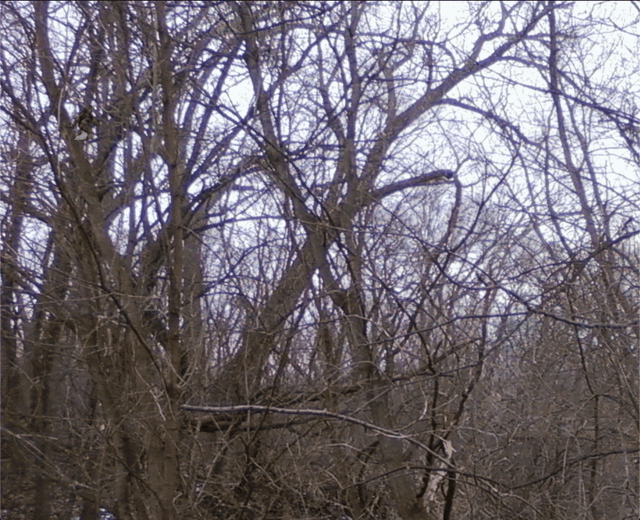
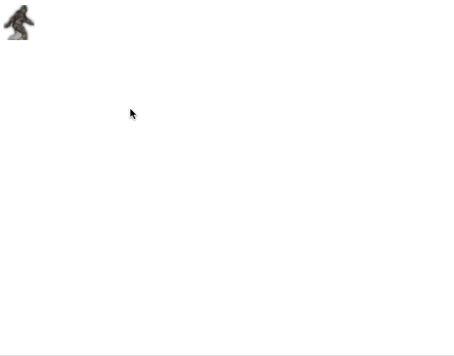
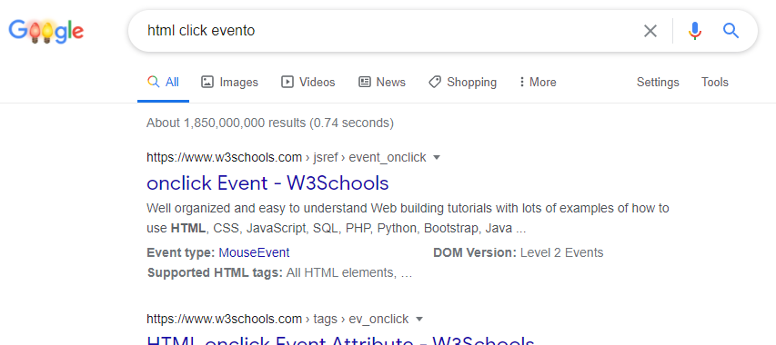
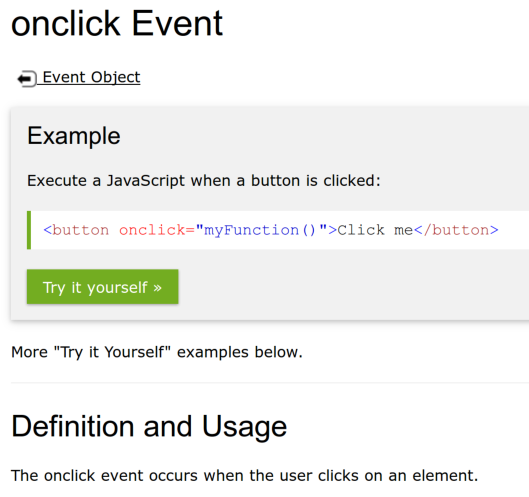
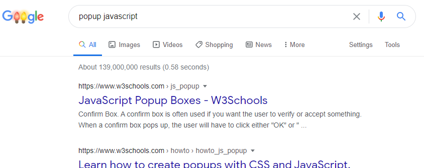
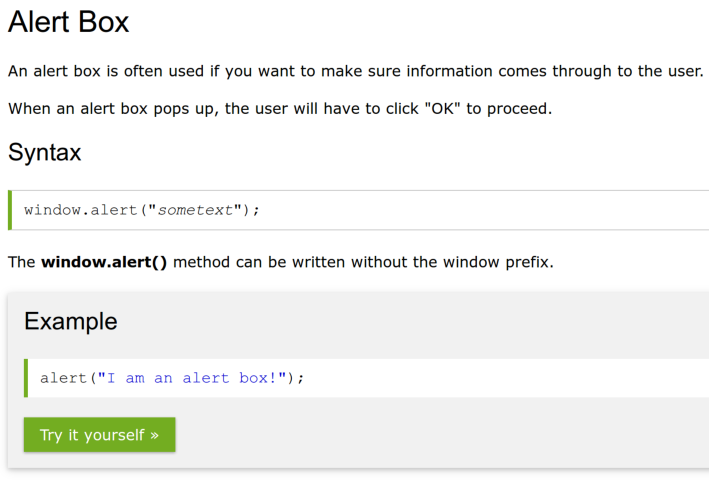
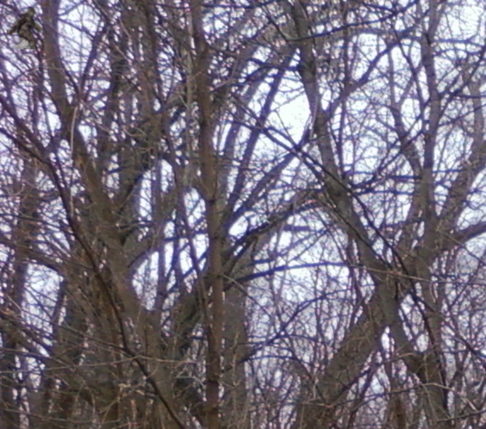
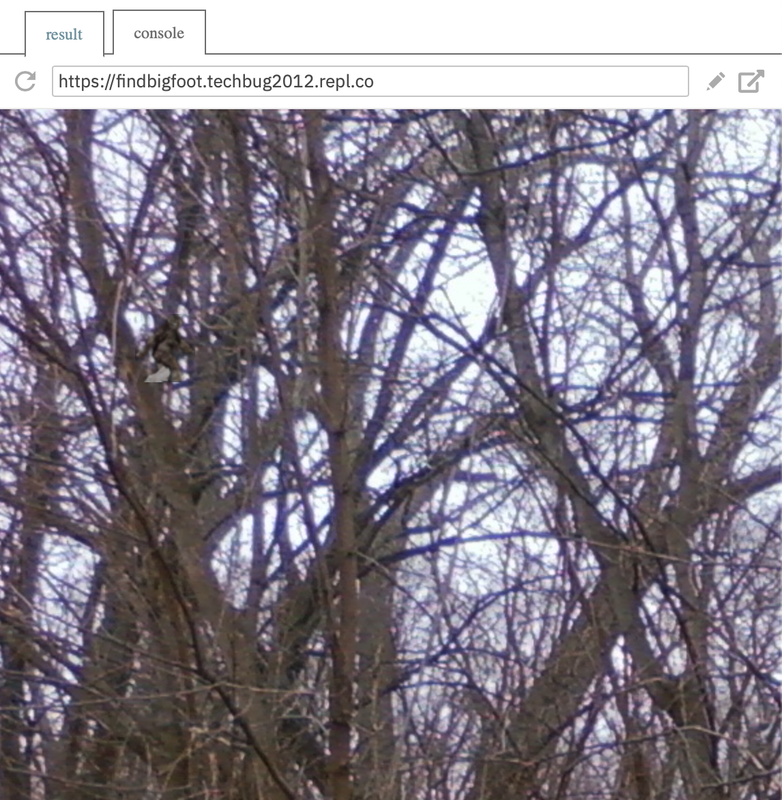
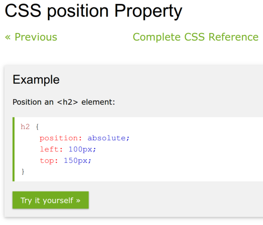
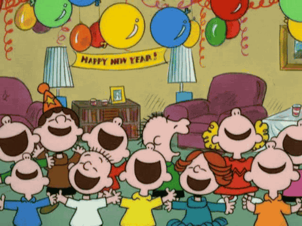

---

title: 'Encontre o Pé Grande'
description: 'Jogo simples para encontrar o Pé Grande utilizando HTML, CSS e JS'  
bg-image: "/workshops/pe-grande/img/pe-fundo.png"
permalink: /workshops/pe-grande/
order: 2

---

<center>Faça um piano no navegador utilizando Tone.js</center>  
<center>
Feito por <a href="https://github.com/ad510" target="_blank">@ad510</a>
e <a href="https://github.com/qmogh" target="_blank">@qmogh</a>
</center>
<center>Traduzido por <a href="https://github.com/vitorvavolizza" target="_blank">@vitorvavolizza</a></center>

<br />

Neste workshop, você fará um jogo sobre encontrar o Pé Grande. Ficará mais ou menos assim:



Links para uma demonstração ao vivo e do código final abaixo. Este workshop deve levar cerca de 1 hora.

[**Demonstração ao vivo**](https://pe-grande.hcbjcentro.repl.co/)

[**Código final**](https://repl.it/@hcbjcentro/pe-grande)

**No caminho, você vai:**

- Aprender como fazer a manipulação de eventos e como criar caixas pop-up em JavaScript.
- Definir uma imagem de fundo para uma página web.
- Definir diretamente as coordenadas de um elemento.
- Mais importante ainda, praticar as habiliades de dar um Google para que você possa se tornar um hacker independente.

## Configurar o projeto

Abra um novo projeto HTML no <a href="https://repl.it/languages/html" target="_blank"> **repl.it**/languages/html </a>

### Obter imagens para o jogo

1. Vá para <a href="https://github.com/vitorvavolizza/hackclubbjcentro_website/tree/master/docs/workshops/pe-grande/assets" target="_blank"> esse link.</a>
2. Clique em cada imagem, depois clique com o botão direito do mouse e **Salvar Imagem Como** para salvá-la em seu computador
3. Arraste todas as imagens que você salvou para a barra lateral do repl.it

Agora você está pronto e já tem as imagens de que precisa!

## Criando o jogo

O que precisa estar em um jogo para encontrar o Pé Grande? Bem, ele precisa do Pé Grande, e precisa dizer ao jogador quando o Pé Grande tiver sido encontrado.

### Tirando o Pé Grande de seu habitat natural

Há rumores de que o habitat natural do Pé Grande é uma floresta no noroeste do Pacífico. O que acontece se você o tirar de seu habitat natural e colocá-lo em uma tela de computador? Será que ele gritaria? Será que ele rasgaria o computador?

Felizmente para você, nós fizemos a parte difícil de tirá-lo da selva e colocá-lo em cativeiro na Internet, e o Pé Grande pode ser encontrado em seu projeto repl.it :)

Então agora você tem que colocar uma **imagem** dele em seu jogo, como você fez no workshop [Personal Website](.../website_pessoal/). Para adicionar uma imagem, nós usamos:

```html

```

Quando terminar, você deve ver o Pé Grande na visualização ao vivo, desta forma:


E o arquivo `index.html` vai ter esse aspecto:

```html
<!DOCTYPE html>
<html>
  <head></head>
  <body>
    
  </body>
</html>
```

### Contando ao jogador quando o Pé Grande tiver sido encontrado

Um jogo precisa de interação para ser um jogo, então vamos exibir uma caixa pop-up sempre que o jogador clicar no Pé Grande, desta forma:



Como você pode fazer isso?

Uma das habilidades mais importantes para se tornar um hacker independente é saber como fazer as coisas no Google quando preso. Então vamos começar dando um Google por "[HTML click evento](https://www.google.com/search?q=html+click+evento)":



Clicando no primeiro link, leva você irá para [aqui](http://www.w3schools.com/jsref/event_onclick.asp):

> 

Aha! Parece que sempre que você coloca `onclick="myFunction()"` em uma tag como `button` ou `img`, ele executa o código [**JavaScript**](http://www.w3schools.com/js/) que você coloca nas aspas sempre que essa tag é clicada.

Recapitulando:

- O HTML controla o conteúdo da página
- O CSS controla o estilo e o layout
- O JavaScript controla a funcionalidade e interatividade

Queremos que nosso código JavaScript exiba uma caixa pop-up dizendo que você ganhou. Então agora vamos dar um Google por "[popup JavaScript](https://www.google.com/search?q=popup+javascript)":

> 

O primeiro link leva você [aqui](http://www.w3schools.com/js/js_popup.asp):

> 

Parece que quando você executa `alert("Eu sou uma caixa de alerta!");` abre uma caixa pop-up mostrando o texto dentro das aspas. Portanto, se ajeitarmos tudo, nossa tag 'img' deve ficar assim:

```html

```
Mude sua tag `img` para ter essa aparência também, depois clique no Pé Grande na visualização ao vivo.

Oops, não funcionou! Por que isso aconteceu?

Outra habilidade importante quando estiver hackeando é saber como consertar as coisas quando elas dão errado. repl.it dá uma dica: a aspas após o `alert(` tem um sublinhado vermelho.

Aqui está o que deu errado. Esperávamos que a aspas após `alert(` indicasse o início da mensagem, mas o que realmente fez foi indicar o fim do atributo `onclick`.

Aqui está um pequeno truque que você pode utilizar para corrigir isso. No JavaScript, você pode utilizar `"` ou `'` ao redor do texto (o termo técnico é uma [**string**](http://www.w3schools.com/js/js_strings.asp)). Portanto, mude as aspas internas para aspas simples, como aqui:

```
onclick="alert('Muito bem! Você encontrou o Pé Grande!');"
```

E agora, clicando no Pé Grande, a mensagem deve ser exibida.

Neste ponto, seu `` deve ter este aspecto:

```html

```

Parabéns, você tem um jogo funcionado agora! Vocês já terminaram! Agora você pode ir à [FGL](https://fgl.com) e vender seu jogo a patrocinadores e ganhar milhões de dólares!

## Escondendo o Pé Grande

Acho que você já percebeu o problema. Este jogo é muito fácil! Quero dizer, o Pé Grande está apenas sentado lá fora ao ar livre, implorando para que você clique nele.

### Colocando o Pé Grande de volta em seu habitat natural

Isso deve ser porque nós o tiramos de seu habitat natural. Veja, normalmente o Pé Grande está escondido em uma floresta densa, o que torna difícil encontrá-lo. Vamos consertar isso adicionando uma **imagem de fundo** de uma floresta. Já carregamos `floresta.jpg`, a imagem que vamos utilizar.

Quando você estiver fazendo seus próprios projetos, você não terá workshops contando a solução para cada passo. Portanto, desta vez, vamos praticar suas habilidades de dar um Google e ver se você pode descobrir como definir essa imagem de fundo sem ser informado da solução! Depois de adicionar a imagem de fundo, a visualização ao vivo fica assim:



Quando você terminar, ou se você estiver simplesmente realmente preso, incluímos uma solução de amostra abaixo. (Mas há outras maneiras de adicionar a imagem de fundo, portanto, se sua solução não for igual à minha, tudo bem).

Exemplo de solução, no arquivo `style.css`:

```css
body {
  background-image: url('/floresta.jpg');
}
```

Há várias maneiras de acrescentar a imagem de fundo. Aqui está uma maneira:

1. Pesquise `html background image`.
2. O primeiro link o traz aqui: http://www.w3schools.com/cssref/pr_background-image.asp
3. Há um exemplo próximo ao topo. Você pode clicar em "Try it Yourself" para ver o HTML completo do exemplo.
4. Abra o arquivo `style.css` como no exemplo, mas substitua a URL pela imagem da floresta. Você não precisa da regra da cor de fundo, já que já estamos definindo uma imagem de fundo.
5. Lembre-se de linkar seu arquivo CSS ao seu arquivo HTML!

### Definindo a localização do Pé Grande

Agora sim! Mas o canto superior esquerdo é um lugar bem entediante para esconder o Pé Grande. Você consegue descobrir como colocar a **posição** do Pé Grande em algum outro lugar? Esta é mais difícil, e pode levar alguma tentativa e erro, mas vale realmente a pena o esforço para ver se você mesmo consegue descobrir. Depois disso, a posição do Pé Grande estará em algum lugar no meio da floresta, ao invés do canto superior esquerdo, como este:



OK, está funcionando? Se você precisar de ajuda, tente perguntar ao seu vizinho ou ao líder do workshop por dicas.

#### Exemplo de solução

Vamos caminhar através dos passos de uma maneira de resolver isto.

Google "[HTML position](https://www.google.com/search?q=html+position)".


O primeiro link leva você [aqui](http://www.w3schools.com/cssref/pr_class_position.asp):



Ele tem algum código CSS mostrando como "posicionar um elemento `<h2>`":

Mas não queremos posicionar um elemento `<h2>`. Queremos posicionar um elemento ``. Portanto, digitamos o código acima no arquivo `style.css`, mas digitando `img` em vez de `h2`.

```css
img {
  position: absolute;
  left: 100px;
  top: 150px;
}

### Carregando o Pé Grande Antes do Fundo

Neste momento o Pé Grande carrega antes que a imagem de fundo, a menos que você tenha uma conexão muito rápida com a internet e nós não queremos isso! Vamos corrigir isso executando o código somente após a página ter sido carregada.

Assim como fizemos com o código quando alguém clicou usando `onclick`, vamos chamar uma função quando a página tiver carregado com `onload`. Você pode procurar isso no Google procurando por "on page load". Vamos em frente e fazer uma tag de script para nossa nova função no arquivo JavaScript, `script.js`:

```js
function carregarPeGrande() {}
```

Também devemos ir em frente e adicionar o atributo `onload` à tag do body. Há mais algumas coisas que temos que fazer. Primeiro, vá em frente e se livre da tag `src`, pois vamos adicionar isso com a função. Depois, adicione um `id` à tag `img`. Isto é para que possamos mudar o atributo `src` depois que a página for carregada.

```html
<body onload="carregarPeGrande()">
  
</body>
```

Agora, vamos pegar a tag de `img` e mudar sua `src` para nosso amigo Pé Grande.

```js
function carregarPeGrande() {
  document.getElementById('peGrande').src = 'pegrande.png'
}
```

O Pé Grande deve agora ser carregado após o fundo. Conseguimos!

Sinta-se à vontade para experimentar os valores `left` e `top` para encontrar um bom lugar para esconder o Pé Grande.

## Tornando o jogo mais difícil

Agora temos outro problema. Este jogo é... muito fácil. Quando alguém o jogar uma vez, será capaz de vencê-lo toda vez, sem nenhum desafio! Precisamos escrever uma função que irá mover o pé grande aleatoriamente em torno da página depois que você vencê-lo.

Abra seu arquivo script.js e vamos fazer uma nova função `moverPeGrande;`

```js
function moverPeGrande() {}
```

Agora lembre-se, estamos tentando mover o pé grande aleatoriamente em torno da tela. Portanto, a primeira coisa que precisamos fazer é fazer uma variável que obtenha nossa imagem. Como anteriormente, usaremos "document.getElementbyId".

```js
function moverPeGrande {
  var picture = document.getElementById('peGrande')
}
```

Isto nos ajudará mais tarde.

Agora veja como posicionamos o pé grande no arquivo css. Temos dois números: A posição do pé grande do topo e sua posição da esquerda. Portanto, esses são os dois números que têm que ser aleatórios para que ele possa se mover. Tente pesquisar no Google e descubra uma maneira de gerar um número aleatório.

Há algumas maneiras diferentes de resolver isto, mas nós pesquisamos no Google "gerar um número aleatório em javascript" e fomos ao primeiro resultado, que nos disse para utilizarmos `Math.random()`

Portanto, como temos dois números para gerar (para `left:` e `top:`), precisamos criar duas novas variáveis para esses valores.

```js
function moverPeGrande {
  var picture = document.getElementById('peGrande')

  var x = Math.random() * 600
  var y = Math.random() * 600
}
```

Isto irá gerará dois números aleatórios entre 0-600 sempre que a função for executada.

Agora que temos nossos dois números, temos que fazê-los realmente se aplicarem à nossa variável da imagem. Aqui, usaremos o left e o top da propriedade style.

```js
function moverPeGrande {
  var picture = document.getElementById('peGrande')

  var x = Math.random() * 600
  var y = Math.random() * 600

  picture.style.top = x + 'px'
  picture.style.left = y + 'px'
  }
}
```

A variável picture buscará o elemento que tem o `id` = `peGrande` e definirá a posição superior e esquerda para os números aleatórios que ela gera.

Depois, voltando ao nosso arquivo html. Precisamos fazer com que sempre que ganharmos o jogo e encontrarmos o Pé Grande, a função moverPeGrande será chamada e o moverá para um novo local com base nos dois números que acabamos de gerar.

Vamos criar um novo método onclick em nossa tag `` no arquivo html.

```html

```

Agora vamos tentar executar isso e ver se funciona.

Será que funcionou?

Não?

Não. Vamos ver o que podemos fazer a respeito disso.

Parece que ter dois métodos onclick está confundindo o programa. Tornará muito mais fácil e mais eficiente mover o alerta para a função moverPeGrande, para que tudo aconteça de uma só vez.
Vamos tirar o `alert` da tag `img` e colocá-lo em nossa função moverPeGrande

Então agora, nosso novo `` no arquivo html deve se parecer com isto

```html

```

E nossa função `moverPeGrande` no scripts.js deve se parecer com isto:

```js
function moverPeGrande() {
  alert('Muito bem! Você encontrou o Pé Grande!')
  var picture = document.getElementById('peGrande')

  var x = Math.random() * 600
  var y = Math.random() * 600

  picture.style.top = x + 'px'
  picture.style.left = y + 'px'
}
```
Agora vamos tentar. Vá em frente e clique no pé grande.

O alerta apareceu? Sim?

Legal!

E agora o "Pé Grande" se moveu?

Muito massa, ótimo trabalho!

### Celebre!

Parabéns, você tem um jogo funcionado! Você terminou!



Mais importante ainda, ao praticar suas habilidades de Google, você está a caminho de se tornar um hacker independente.

## Hackeando

Agora é a chance de fazer do jogo o seu próprio jogo! Para inspiração, você pode procurar [aqui](http://andrewd.50webs.com/bigfoot) para ver o que é possível.
